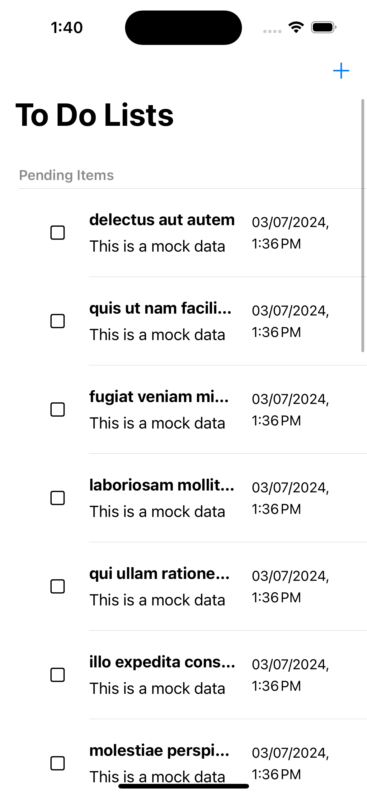
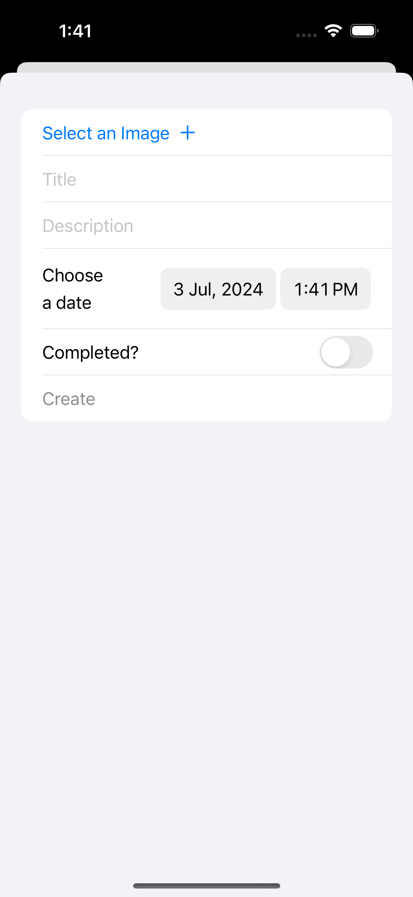
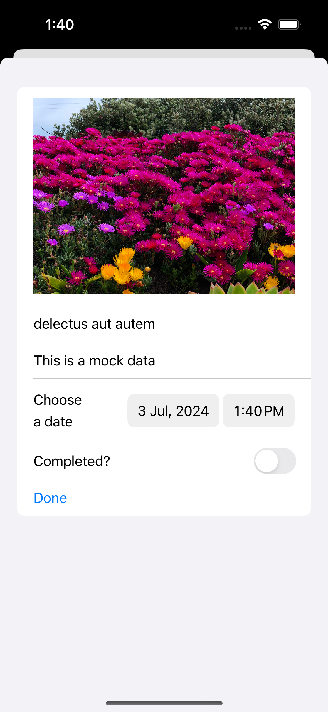
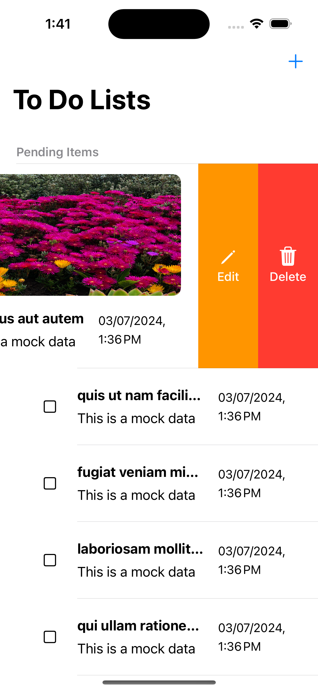
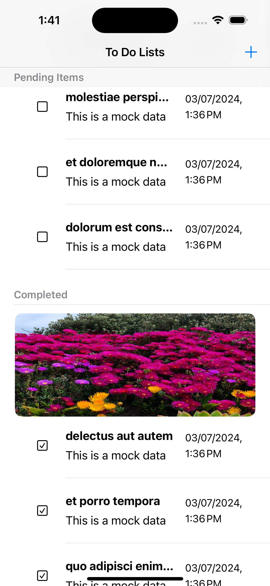

### To Do App
Your daily companion to track your to do items. 

### Build and Run
To build an run the project: 
1. Clone the GitHub repository to you machine by using git
`https://github.com/siam-sharif-ami/ToDoProject.git`
2. Download the googleservice-info.plist file from [here](https://drive.google.com/file/d/1N8C95NxAvdexHnDOcuWkxrfyARc_RkWx/view?usp=sharing)

### Features
1. To do Items page
2. Add new items
3. Delete an existing item
4. Edit an existing item

### Screenshots 
**To do items page**\

**Add new item**\

**Edit an existing item**\

**Delete an item**\

**Mark as done**\

### Sample Video Demonstrating App Functionality

**Assumptions and Decisions made during development:**
1. Use of MVVM with Repository pattern
2. Use Kingfisher for Image View
3. Use firebase storage for storing image files
4. Use of SwiftData as local database
